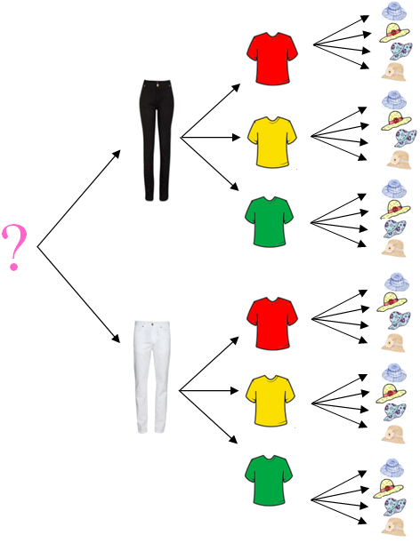
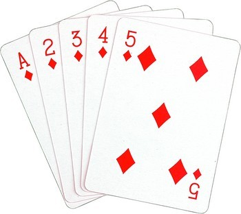

Teoria dos Conjuntos
====================

Conceitos Básicos
-----------------

[Representações de Conjuntos e Elementos]{}

-   Um [**conjunto**]{} é uma coleção de objetos;

-   Descrição dos elementos:\
    $A = \left\{\text{Estudantes matriculados em Probabilidade e Estatística} \right\}$;\
    $B = \left\{n: n~\text{é inteiro e }1\le n \le 6 \right\}$;

-   Enumeração dos elementos:\
    $C = \left\{\text{Alice, Bruno, Camila, Diego} \right\}$;\
    $D = \left\{3,2,5,4,6,1\right\}$;

-   Diagramas:\

    at (0,0) ; (0,0) circle \[x radius=2cm, y radius=2cm\]; at (-1,0)
    [Alice]{}; at (1,0) [Bruno]{}; at (0,1) [Camila]{}; at (0,-1)
    [Diego]{}; at (2,2) [$C$]{}; at (2.3,-1.7) [$A=C$]{};

     

    at (0,0) ; (0,0) circle \[x radius=2cm, y radius=2cm\]; at (-1,0)
    [$1$]{}; at (1,-0.5) [$3$]{}; at (1,0.5) [$5$]{}; at (0,0) [$2$]{};
    at (0,1) [$4$]{}; at (0,-1) [$6$]{}; at (2,2) [$D$]{}; at (2.3,-1.7)
    [$B=D$]{};

[Operações com conjuntos]{}

-   União $\cup$, adição, operação **OU**: $A + B = A \cup B$ elementos
    pertencem a $A$ **OU** a $B$ **OU** a ambos;

-   Intersecção $\cap$, produto, operação **E**: $AB = A \cap B$
    elementos pertencem a $A$ **E** a $B$ *simultaneamente*;

 

 

[Operações com conjuntos]{}

-   Diferença: $A - B$ elementos que pertencem a $A$ *exceto* os que
    pertencem a $B$;

 

 

[Operações com conjuntos]{}

-   Complementar: $\overline{A} = A^{C} = S - A$ todos os elementos de
    $S$ *exceto* os que pertecem a $A$;

 

 

[Operações com conjuntos]{}

-   União $\cup$, adição, operação **OU**: $A + B = A \cup B$ elementos
    pertencem a $A$ **OU** a $B$ **OU** a ambos;

-   Intersecção $\cap$, produto, operação **E**: $AB = A \cap B$
    elementos pertencem a $A$ **E** a $B$ *simultaneamente*;

 

 

[Exemplo]{}

-   $A = \left\{1,2,3,5,6,7\right\}$

-   $B = \left\{4,5,6,7\right\}$

<!-- -->

-   $A \cup B$;

-   $A \cap B$;

-   $A - B$;

-   $B - A$;

-   $A^{C}$;

-   $B^{C}$;

 

 

[Propriedades]{}

  ------------------- --------------------------------------------------
  Comutativa          $A \cup B = B \cup A$
                      $A \cap B = B \cap A$
  Associativa         $(A \cup B) \cup C = A \cup (B \cup C)$
                      $(A \cap B) \cap C = A \cap (B \cap C)$
  Distributiva        $(A \cup B) \cap C = (A \cap C) \cup (B \cap C)$
                      $(A \cap B) \cup C = (A \cup C) \cap (B \cup C)$
  Absorção            $(A \cup B) \cap A = A$
                      $(A \cap B) \cup A = A$
  Leis de De Morgan   $A - (B \cup C) = (A - B) \cap (A - C)$
                      $A - (B \cap C) = (A - B) \cup (A - C)$
  ------------------- --------------------------------------------------

[Propriedades]{}

  Teoria dos Conjuntos      Probabilidade                                            Simbologia
  ------------------------- ------------------------------------------------ --------------------------
  Conjunto Universo         Espaço Amostral (evento certo)                              $S$
  Elemento                  Resultado (ponto amostral)                              $s_i \in S$
  Subconjunto               Evento                                                  $A,B,\dots$
  Conjunto Vazio            Evento impossível                                       $\emptyset$
  Conjunto Unitário         Evento só ocorre se um único resultado ocorrer    $A = \left\{s_i\right\}$
  União de Conjuntos        Pelo menos um evento ocorre                              $A \cup B$
  Interseção de Conjuntos   Todos os eventos ocorrem simultaneamente                 $A \cap B$
  Complemento               Negação do evento                                  $\overline{A} = S - A$
  Conjuntos disjuntos       Eventos mutuamente exclusivos                      $A \cap B = \emptyset$

Técnicas de Contagem
====================

[Princípio fundamental da contagem]{} Seja uma operação ou atividade que
consiste na execução de $k$ etapas sucessivas, sendo que:

-   Há $n_1$ formas diferentes de realizar a etapa $1$;

-   Há $n_2$ formas diferentes de realizar a etapa $2$;\
    $\cdots$

-   Há $n_k$ formas diferentes de realizar a etapa $k$;

Se as etapas são independentes entre si então o número total $N$ de
formas de se completar a operação ou atividade é dado por:
$$N = n_1, n_2, \cdots, n_k$$

[Exemplo]{} Dispõe-se de 4 chapéus, 2 calças e 3 camisetas. Existem
portanto: $$N = 4 \times 2 \times 3 = 24$$ formas diferentes de se
escolher uma vestimenta, nestas condições.

 

[Permutações]{} São sequências ordenadas de $n$ objetos retirados sem
reposição de um conjunto de $n$ elementos. Cada sequência é obtida após
a escolha de $n$ elementos, de forma que:

-   Há $n$ formas diferentes de escolher o primeiro elemento;

-   Há $n - 1$ formas diferentes de escolher o segundo elemento;\
    $\cdots$

-   Há $2$ formas diferentes de escolher o $(n - 1)$-ésimo elemento
    (penúltimo);

-   Há $1$ forma de escolher o $n$-ésimo elemento (último);

Logo, pelo Princípio Fundamental da Contagem, o número de permutações de
n elementos é dado por:
$$P_n = n \times (n - 1) \times (n - 2) \times \cdots \times 2 \times 1 = n!$$

[Exemplo]{} De quantas formas diferentes podemos organizar 4 crianças em
uma fila?\
$P_4 = 4! = 24$ formas diferentes.

 

{width="\linewidth"}

[Permutações de subconjuntos – Arranjos]{} São sequências ordenadas de
$k$ objetos retirados sem reposição de um conjunto de $n$ elementos, tal
que $k \le n$. Cada sequência é obtida após a escolha de $k$ elementos,
de forma que:

-   Há $n$ formas diferentes de escolher o primeiro elemento;

-   Há $n - 1$ formas diferentes de escolher o segundo elemento;\
    $\cdots$

-   Há $n-k+1$ formas diferentes de escolher o $k$-ésimo elemento
    (último);

Logo, pelo Princípio Fundamental da Contagem, o número de arranjos de
$n$ elementos em subconjuntos de $k$ elementos é dado por:
$$A_k^n = n \times (n - 1) \times (n - 2) \times \cdots \times (n-k+1) = \frac{n!}{(n-k)!}$$

[Exemplo]{} De quantas formas diferentes podemos organizar uma fila de 3
crianças escolhidas de um grupo de 5 crianças?\
$\displaystyle A_3^5 = \frac{5!}{2!} = 60$ formas diferentes.

 

{width="\linewidth"}

[Permutações de elementos similares]{}

-   São conjuntos de n objetos de $k$ tipos diferentes $(k \le n)$, onde
    os [**elementos do mesmo tipo são indistintos**]{}, e dentre os
    quais temos $n_1$ objetos do tipo 1, $n_2$ objetos do tipo
    2,$\cdots$, $n_k$ objetos do tipo $k$;

-   Um total de $n!$ sequências podem ser obtidas por permutação dos $n$
    objetos.

-   Fixando as posições dos objetos, há outras $n_1!$ sequências
    indistintas obtidas permutando-se apenas os objetos do tipo 1 entre
    si.

-   Do mesmo modo, obtém-se $n_2!$ sequências indistintas permutando
    objetos do tipo 2, e assim consequentemente para tipo
    $3, 4, \cdots, k$.

-   As $n!$ permutações possíveis dos $n$ objetos podem ser agrupadas em
    blocos contendo $n_1!, n_2!, \cdots, n_k!$ sequências indistintas.
    Assim, o número total de sequências distintas é de:
    $$N = \frac{n!}{n_1!n_2!\cdots n_k!}$$

[Exemplo]{} De quantas formas diferentes podemos distribuir 3 laranjas,
2 bananas e 1 pera entre 6 crianças?\
$\displaystyle N = \frac{6!}{3!2!1!} = 60$ formas diferentes.

[Exemplo]{} No processamento de uma chapa metálica, 4 entalhes, 2
dobraduras e 3 furos são requeridos. Se as operações podem ser feitas em
qualquer ordem, de quantas maneiras diferentes o processamento pode ser
realizado?\
$\displaystyle N = \frac{9!}{4!3!2!} = 1260$ formas diferentes.

[Combinações]{}

-   Subconjuntos de $k$ objetos, [**tomados em qualquer ordem**]{},
    retirados sem reposição de um conjunto de $n$ elementos, sendo
    $k \le n$;

-   Semelhante ao dos arranjos, sendo que aqui o que importa é apenas
    [**quais**]{} são os objetos escolhidos, [**Não importando sua
    ordem**]{};

-   Podemos formar $A_k^n$ arranjos de tamanho $k$ com os $n$ objetos;

-   Cada arranjo escolhido resulta em mais outros $k!$ obtidos por
    simples permutação da ordem dos objetos e que são portanto
    [**indistintos**]{};

Assim, o número de combinações distintas de n objetos em subconjuntos de
$k$ objetos é dado por:
$$C_k^n = \frac{n!}{k!(n-k)!} \hfill \rightarrow \hfill C_k^n = \begin{pmatrix}  n \\ k \end{pmatrix}$$

[Exemplo]{} De quantas formas diferentes podemos obter uma mão de 5
cartas no baralho?\
$\displaystyle C_5^{52} = \begin{pmatrix}  52 \\ 5 \end{pmatrix} = \frac{52!}{5!47!} = 2598960$
maneiras.

 

{width="0.7\linewidth"}
